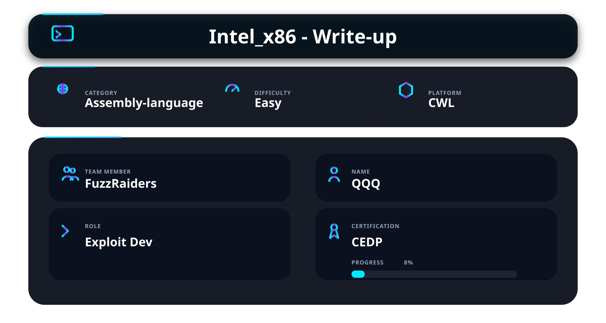
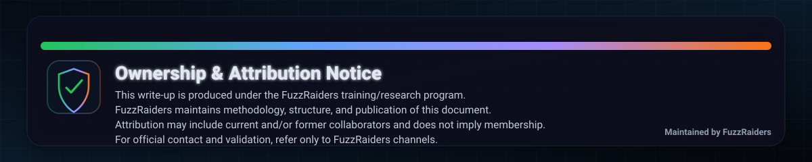

## 📌 Overview

This write-up covers the **Intel x86 fundamentals** section from the **Certified Exploit Development Professional (CEDP)** course.

The goal of this section is to understand how programs actually execute inside a system.

At a low level, every program depends on:

* Instructions being executed
* Registers storing working data
* Memory organizing information
* The CPU controlling the flow

Understanding this process allows you to move beyond simply running programs and start understanding how execution can be influenced or redirected.

**This write-up does not reproduce or spoil course content.**
**It reflects an independent understanding of the concepts and presents them in a simplified and practical way.**

---

## In this write-up, we cover

* Registers and their roles
* Instruction execution basics
* Memory layout of a process
* Stack behavior (PUSH / POP)
* Function structure and calling conventions
* How these concepts relate to exploitation

---

## 🛠 Tools

* x86 Assembly → Understanding CPU-level instructions
* Debuggers (x32dbg / GDB) → Observing execution step by step
* Disassemblers (Ghidra / IDA) → Analyzing compiled programs
* Virtual Lab → Safe testing environment

---

## Understanding Execution

A program runs through a simple process:

```id="n3qz6k"
Instructions → CPU → Registers → Memory
```

A practical way to think about it:

* Instructions define what needs to be done
* The CPU executes those instructions
* Registers hold temporary values during execution
* Memory stores data and program structure

If this flow is controlled or disrupted, the behavior of the program changes.

---

## Registers

Registers are small storage locations inside the CPU that are used during execution.

They hold temporary data and are used constantly while instructions are being processed.

---

### General Purpose Registers

| Register | Role                           |
| -------- | ------------------------------ |
| EAX      | Stores results                 |
| EBX      | Holds data                     |
| ECX      | Used for counting              |
| EDX      | Used for additional operations |

Example:

When a calculation is performed, the result is often stored in EAX before being used elsewhere.

---

### Special Purpose Registers

| Register | Role                             |
| -------- | -------------------------------- |
| ESP      | Points to the top of the stack   |
| EBP      | Marks the current function frame |
| ESI      | Points to source data            |
| EDI      | Points to destination data       |

These registers are mainly used to manage function execution and data movement.

---

### Instruction Pointer (EIP)

EIP stores the address of the next instruction to execute.

If a program is seen as a sequence of steps, EIP determines which step runs next.

If EIP is changed, execution is redirected. This is a key concept in exploitation.

---

## Instructions

Instructions are basic commands executed by the CPU.

---

### Data Movement

```asm id="v0y3fd"
MOV EAX, 1
MOV EBX, EAX
```

Moves data between registers.

---

### Arithmetic

```asm id="yq5qv1"
ADD EAX, 5
SUB EBX, 2
```

Performs simple calculations.

---

### Control Flow

```asm id="3m7e8t"
JMP address
CALL function
RET
```

Controls execution flow:

* JMP moves execution to another location
* CALL jumps to a function and stores a return point
* RET returns to that stored location

---

## Memory Layout

A program in memory is typically organized as:

```id="a1z7qx"
[ Stack ]   ← grows downward
[ Heap ]
[ Data ]
[ Code ]
```

* Code contains instructions
* Data stores variables
* Heap manages dynamic memory
* Stack handles function calls

---

## Stack

The stack is used to manage function execution and temporary data.

It follows a simple structure:

* New data is added on top
* Data is removed from the top

---

### PUSH and POP

```asm id="2h3d4x"
PUSH EAX
POP EBX
```

* PUSH adds data to the stack
* POP removes data from the stack

---

### Function Call Example

When a function is executed:

1. The return address is placed on the stack
2. The function executes
3. RET uses that address to return

This mechanism keeps execution organized.

---

## Calling Convention

Calling conventions define how functions operate internally.

---

### Function Start

```asm id="z8k2lp"
PUSH EBP
MOV EBP, ESP
```

Creates a new function frame.

---

### Function End

```asm id="h6r1uv"
MOV ESP, EBP
POP EBP
RET
```

Restores the previous state and returns execution.

---

## Parameter Passing

Function arguments are typically passed through the stack.

Example:

```c id="6p1d9w"
sum(2, 3)
```

The values are placed on the stack and accessed inside the function.

---

## Exploitation Mapping

| Concept   | Why It Matters                      |
| --------- | ----------------------------------- |
| Registers | Control data and execution behavior |
| ESP       | Controls position within the stack  |
| EBP       | Helps locate function data          |
| EIP       | Controls execution flow             |
| Stack     | Stores return addresses             |
| RET       | Redirects execution                 |

---

## What This Section Teaches

* How programs execute at the CPU level
* How registers and memory interact
* How function calls are structured
* How the stack controls execution flow

---

## Summary

This section explains how execution works internally in x86 systems.

It covers how instructions are processed, how registers store temporary data, and how the stack manages function calls and return addresses.

These components work together to maintain consistent program execution.

---

## 📌 Conclusion

Understanding x86 provides the ability to analyze and influence program execution.

At this level, behavior is no longer abstract. It becomes structured and predictable based on how instructions, memory, and control flow interact.

This is the point where foundational knowledge becomes directly useful for exploitation.

> “If you understand execution, you can control it.”

---

This work is part of **FuzzRaiders**’ structured hands-on training and research program, where every lab, project, and technical study is formally documented, reviewed, and validated to ensure real-world applicability, methodological rigor and real-world security execution.


Happy hacking 🚀


---



---
