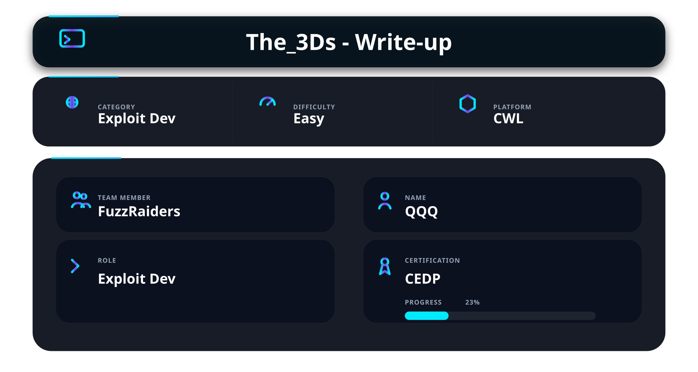

# 📌 Overview

This write-up covers the foundational “Three Ds” heavily used throughout exploit development and reverse engineering:

- Debugger
- Disassembler
- Debugging

These concepts are essential for understanding binary execution flow, inspecting memory behavior, analyzing crashes, reverse engineering applications, and developing low-level vulnerability research skills.

The objective was to build practical familiarity with binary analysis workflows and understand how dynamic and static analysis techniques are used during exploit development.

---

🛠️ Tools Used

| Tool           | Purpose                                                                                                                                                 |
| -------------- | ------------------------------------------------------------------------------------------------------------------------------------------------------- |
| GDB            | Used for runtime debugging, breakpoint management, register inspection, and analyzing program execution flow                                            |
| GEF / pwndbg   | Enhanced GDB extensions used for stack inspection, hexdump analysis, cyclic pattern generation, memory visualization, and exploit development workflows |
| Ghidra         | Reverse engineering framework used for static binary analysis and assembly inspection                                                                   |
| IDA Pro        | Interactive disassembler used for analyzing functions, control flow, and binary structure                                                               |
| objdump        | Command-line disassembler used to inspect assembly instructions and ELF sections directly from the terminal                                             |
| readelf        | Used for extracting ELF information such as sections, symbols, and binary structure                                                                     |
| strings        | Used for extracting readable ASCII strings from binaries during reconnaissance and analysis                                                             |
| checksec       | Used to identify enabled binary security protections such as NX, PIE, RELRO, and Stack Canary                                                           |
| ltrace         | Used to trace dynamically linked library calls during runtime analysis                                                                                  |
| strace         | Used to monitor system calls and analyze process interactions with the operating 
---

# 1️⃣ Debugger

A debugger is used to perform **dynamic analysis** on a running binary.

Unlike static analysis tools, debuggers allow researchers to pause execution and inspect the internal state of a program during runtime.

Debuggers are commonly used for:
- Crash analysis
- Buffer overflow research
- Memory corruption analysis
- Register tracing
- Payload testing
- Instruction flow analysis

Common debuggers:
- GDB
- x64dbg
- WinDbg

---

## Launching the Binary

Start the binary inside GDB:

```bash
gdb ./vuln_binary
````

This loads the executable into the debugger for runtime analysis.

---

## Running the Program

Run the program:

```bash id="nh0gtt"
run
```

Shortcut:

```bash id="v1m6y0"
r
```

Purpose:

* Starts program execution inside GDB.

Pass arguments:

```bash id="l7i9i5"
run AAAA
```

Redirect input:

```bash id="h4pw9k"
run < input.txt
```

These techniques are useful during:

* Fuzzing
* Payload testing
* Buffer overflow analysis

---

## Breakpoints

Breakpoints pause execution at specific locations.

Breakpoint at function:

```bash id="b28g5e"
break main
```

Shortcut:

```bash id="x3mcz9"
b main
```

Breakpoint at memory address:

```bash id="sux4od"
break *0x4011b6
```

Purpose:

* Stops execution before a specific instruction or function executes.

Useful for:

* Monitoring vulnerable functions
* Tracing execution flow
* Inspecting memory before crashes occur

List breakpoints:

```bash id="t7qnnv"
info breakpoints
```

Continue execution:

```bash id="zj4g4h"
continue
```

Shortcut:

```bash id="hl4grv"
c
```

Delete breakpoint:

```bash id="lfzc4h"
delete 1
```

---

## Stepping Through Instructions

Execute next source line:

```bash id="mjq0br"
next
```

Shortcut:

```bash id="gwt7vu"
n
```

Purpose:

* Executes the next line without stepping into called functions.

---

Step into function:

```bash id="kh58ik"
step
```

Shortcut:

```bash id="f4m0k9"
s
```

Purpose:

* Executes the next line and enters called functions.

Useful for:

* Analyzing internal function behavior
* Understanding vulnerable routines

---

Execute next assembly instruction:

```bash id="c69ybv"
nexti
```

Shortcut:

```bash id="fmr2w7"
ni
```

Purpose:

* Executes the next CPU instruction without entering function calls.

---

Step into assembly instruction:

```bash id="41g2cw"
stepi
```

Shortcut:

```bash id="tdxvji"
si
```

Purpose:

* Executes a single assembly instruction and enters called instructions.

These commands are critical for:

* Tracing execution flow
* Understanding assembly behavior
* Analyzing low-level program execution

---

## Register Analysis

Display all registers:

```bash id="0x57ud"
info registers
```

Shortcut:

```bash id="0y9jzh"
i r
```

Purpose:

* Displays CPU register values during execution.

Important registers:

* RIP → instruction pointer
* RSP → stack pointer
* RBP → base pointer

Inspect specific registers:

```bash id="7em6g7"
print $rip
print $rsp
print $rbp
```

Register analysis helps determine:

* RIP/EIP control
* Stack state
* Execution flow
* Memory references

This is essential during exploit development and crash analysis.

---

## Stack & Memory Inspection

Memory inspection is one of the most important parts of exploit development because vulnerabilities often involve corrupted memory, overwritten return addresses, or manipulated stack data.

GDB provides the `x` (examine) command to inspect memory directly.

General syntax:

```bash
x/<count><format><size> <address>
```

Example:

```bash id="oxc62u"
x/40gx $rsp
```

Breakdown:

* `x` → examine memory
* `40` → display 40 entries
* `g` → giant words (8 bytes / 64-bit values)
* `x` → hexadecimal format
* `$rsp` → start reading from the stack pointer register

This command is commonly used to inspect stack contents during buffer overflow analysis.

---

## Inspecting Stack Memory

```bash id="0t4l9n"
x/40gx $rsp
```

Purpose:

* Dumps stack memory starting from the current stack pointer.
* Displays 40 quadwords (8-byte values) in hexadecimal format.

Useful for:

* Identifying overwritten return addresses
* Locating payloads on the stack
* Viewing stack corruption
* Understanding stack layout during crashes

Typical output:

```bash id="l9mmlw"
0x7fffffffe1c0: 0x4141414141414141
0x7fffffffe1c8: 0x4242424242424242
```

This may indicate user-controlled input overwriting stack memory.

---

## Inspecting Instructions Near RIP

```bash id="v4um6r"
x/10i $rip
```

Breakdown:

* `10` → display 10 entries
* `i` → interpret memory as assembly instructions
* `$rip` → instruction pointer register

Purpose:

* Displays upcoming assembly instructions currently being executed.

Useful for:

* Tracing execution flow
* Identifying crashes
* Understanding vulnerable functions
* Following jumps and calls

Typical output:

```bash id="w7sj3o"
=> 0x401146 <main+10>: call strcpy
   0x40114b <main+15>: ret
```

This helps visualize what the CPU is executing in real time.

---

## Displaying Memory as Strings

```bash id="ozk4ll"
x/s 0x404040
```

Breakdown:

* `s` → display memory as a string
* `0x404040` → memory address being inspected

Purpose:

* Reads memory and interprets it as ASCII text.

Useful for:

* Viewing user input
* Identifying hardcoded strings
* Inspecting payloads
* Extracting hidden messages

Typical output:

```bash id="z1o0j7"
0x404040: "admin:password123"
```

This command is frequently used during reverse engineering and binary analysis.

---

## Inspecting Memory in Hexadecimal

```bash id="kljlwm"
x/20x $rsp
```

Breakdown:

* `20` → display 20 entries
* `x` → hexadecimal format
* `$rsp` → stack pointer register

Purpose:

* Displays raw memory values in hexadecimal.

Useful for:

* Analyzing memory corruption
* Verifying payload placement
* Inspecting overwritten stack values
* Tracking buffer overflow behavior

---

## Common Format Specifiers

| Specifier | Meaning     |
| --------- | ----------- |
| x         | Hexadecimal |
| d         | Decimal     |
| s         | String      |
| i         | Instruction |
| c         | Character   |

---

## Common Size Specifiers

| Specifier | Size                 |
| --------- | -------------------- |
| b         | Byte (1 byte)        |
| h         | Halfword (2 bytes)   |
| w         | Word (4 bytes)       |
| g         | Giant word (8 bytes) |

---

## Example Combinations

Display 16 bytes:

```bash id="ncl8yz"
x/16bx $rsp
```

Display 10 instructions:

```bash id="xnr5f8"
x/10i $rip
```

Display 20 giant words:

```bash id="prcsyu"
x/20gx $rsp
```

Display string from memory:

```bash id="zobowv"
x/s 0x404040
```

Understanding memory inspection commands is critical for:

* Buffer overflow exploitation
* Crash analysis
* Reverse engineering
* Shellcode debugging
* Stack corruption analysis

---

## Hexdump Analysis (GEF)

Hexdumping memory is extremely useful for inspecting payload placement and corrupted stack data.

Dump stack memory:

```bash id="lq3z4f"
hexdump qword $rsp
```

Dump 64 bytes:

```bash id="g2ozj8"
hexdump byte $rsp l64
```

Purpose:

* Displays raw memory contents in a structured hexadecimal format.

Useful for:

* Inspecting overwritten return addresses
* Verifying payload alignment
* Analyzing shellcode placement
* Viewing corrupted memory structures

---

## Function Disassembly

Disassemble function:

```bash id="pdsl0m"
disassemble main
```

Shortcut:

```bash id="06d3mt"
disas main
```

Purpose:

* Converts machine instructions into readable assembly code.

Inspect instructions near RIP:

```bash id="w7y1uk"
x/20i $rip
```

Useful for:

* Understanding function logic
* Identifying vulnerable instructions
* Tracing execution flow
* Analyzing stack operations

---

# 2️⃣ Disassembler

A disassembler converts machine code into readable assembly instructions for **static analysis**.

Unlike debuggers, disassemblers analyze binaries without executing them.

Disassemblers are commonly used for:

* Reverse engineering
* Vulnerability discovery
* Function analysis
* Binary structure analysis
* Control flow inspection

Common disassemblers:

* Ghidra
* IDA Pro
* objdump

---

## Binary Information Gathering

Identify binary type and architecture:

```bash id="2i5twy"
file vuln_binary
```

Purpose:

* Displays binary architecture and file format.

Example output:

* ELF 64-bit
* PIE enabled
* Dynamically linked

---

Check enabled protections:

```bash id="55cl8u"
checksec vuln_binary
```

Purpose:

* Identifies enabled binary security protections.

Common protections:

* NX
* PIE
* RELRO
* Stack Canary

These protections directly affect exploitability.

---

## ELF Analysis

Display ELF information:

```bash id="tkdzb0"
readelf -a vuln_binary
```

View ELF sections:

```bash id="jfev1w"
readelf -S vuln_binary
```

View symbols:

```bash id="3z6lq0"
readelf -s vuln_binary
```

Purpose:

* Extracts structural information from ELF binaries.

Useful for:

* Identifying imported functions
* Understanding memory layout
* Reviewing binary sections
* Enumerating symbol tables

---

## objdump Analysis

Disassemble binary:

```bash id="zq7slm"
objdump -d vuln_binary
```

Use Intel syntax:

```bash id="r63w07"
objdump -M intel -d vuln_binary
```

Disassemble only .text section:

```bash id="wnpjlwm"
objdump -d -j .text vuln_binary
```

Purpose:

* Displays assembly instructions directly from the terminal.

Useful for:

* Quick assembly inspection
* Reviewing functions
* Identifying dangerous calls
* Understanding instruction flow

---

## String Analysis

Extract readable strings:

```bash id="flnycx"
strings vuln_binary
```

Search for interesting values:

```bash id="btcz0v"
strings vuln_binary | grep -i pass
```

Purpose:

* Extracts readable ASCII strings from binaries.

Useful for identifying:

* Credentials
* Hidden paths
* Debug messages
* Internal references
* Sensitive data

---

## Runtime Tracing

Trace library calls:

```bash id="9t8kv4"
ltrace ./vuln_binary
```

Purpose:

* Monitors dynamically linked library calls during execution.

Useful for:

* Tracking libc usage
* Identifying vulnerable functions
* Monitoring runtime behavior

---

Trace system calls:

```bash id="1q7y4j"
strace ./vuln_binary
```

Purpose:

* Traces system calls performed by the program.

Useful for:

* Monitoring file access
* Analyzing network behavior
* Understanding process interactions

---

# 3️⃣ Debugging

Debugging is the process of analyzing program behavior to identify vulnerabilities, investigate crashes, and understand memory corruption.

This phase combines both static and dynamic analysis techniques.

---

## Typical Debugging Workflow

1. Trigger the crash
2. Inspect registers
3. Analyze stack memory
4. Identify overwritten values
5. Trace vulnerable instructions
6. Calculate offsets
7. Test payload behavior

---

## Pattern Generation

Generate cyclic pattern:

```bash id="otk7ju"
pattern create 300
```

Purpose:

* Generates a unique cyclic pattern used for offset calculation.

---

Find exact offset:

```bash id="i5qv7z"
pattern offset 0x6161616c
```

Purpose:

* Identifies the exact overwrite position after a crash.

Useful during:

* Buffer overflow analysis
* RIP/EIP overwrite discovery
* Exploit development

---

## Core Dump Analysis

Enable core dumps:

```bash id="v6zmh1"
ulimit -c unlimited
```

Purpose:

* Allows the operating system to generate crash dump files.

Open generated core dump:

```bash id="4d0h8s"
gdb ./vuln_binary core
```

Useful for:

* Offline crash analysis
* Investigating segmentation faults
* Reviewing register states after crashes

---

## Useful GEF / pwndbg Commands

Display debugging context:

```bash id="mvx8lz"
context
```

Display memory mappings:

```bash id="2kek43"
vmmap
```

Search memory:

```bash id="xvf2f5"
search-pattern AAAA
```

Display GOT entries:

```bash id="lu9l5e"
got
```

List discovered functions:

```bash id="4bprlf"
functions
```

Display security protections:

```bash id="6f5yl0"
checksec
```

These helper utilities significantly improve exploit development workflows and binary analysis efficiency.

---

# 📌 Conclusion

The “Three Ds” — Debugger, Disassembler, and Debugging — form a critical foundation in exploit development and reverse engineering.

Understanding how to inspect registers, analyze memory, trace instructions, disassemble binaries, and investigate crashes is essential for developing practical exploit development skills.

Through the CEDP course from CyberWarFare Labs, these concepts provided hands-on exposure to real-world binary analysis workflows used during vulnerability research and exploit development.

Mastering these techniques builds the foundation required for:

* Binary exploitation
* Reverse engineering
* Malware analysis
* Vulnerability research
* Advanced offensive security operations

---

This work is part of **FuzzRaiders**’ structured hands-on training and research program, where every lab, project, and technical study is formally documented, reviewed, and validated to ensure real-world applicability, methodological rigor and real-world security execution.


Happy hacking 🚀


---


---