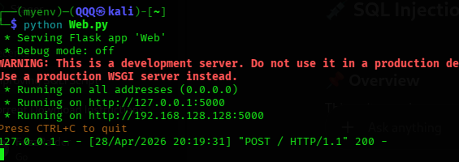
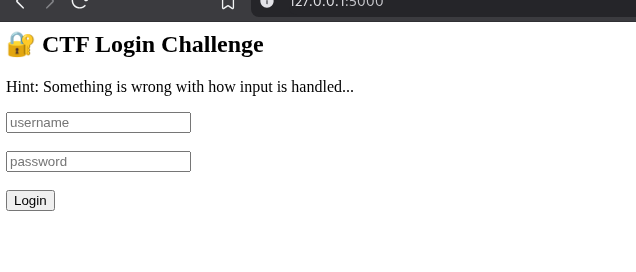
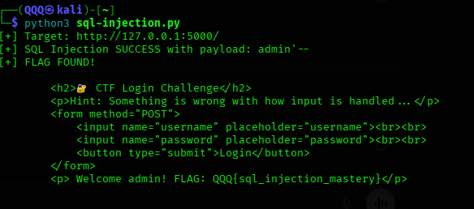
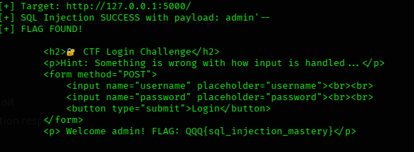

# 📌 Overview

This tutorial demonstrates the process of identifying and exploiting a **SQL Injection vulnerability** using a custom-built vulnerable web application and a Python-based automation script.

The lab simulates a real-world insecure login system where user input is directly embedded into SQL queries without proper validation or sanitization.

The objective of this write-up is to show how authentication logic can be bypassed and how sensitive data (a CTF-style flag) can be retrieved through exploitation.

---

# 🧪 In this write-up, we cover

* Identifying vulnerable input fields
* Understanding SQL query construction
* Performing login bypass using SQL Injection
* Automating detection with a Python script
* Extracting and validating the flag

---

# 🛠 Core Concepts & Tools

* Python → Script development
* Custom Script → SQL Injection detection logic
* Flask → Vulnerable web application
* SQLite → Backend database
* Kali Linux → Testing environment
* SQL Injection → Web exploitation technique

---

# 🧭 Walkthrough

## 1️⃣ Application Setup

A deliberately vulnerable web application was created using Flask and SQLite.



Key characteristics:

* Login form (username and password)
* No input validation
* Dynamic SQL query construction



---

## 2️⃣ Vulnerable Query Analysis

The backend constructs SQL queries as follows:

```sql
SELECT * FROM users 
WHERE username = '$username' AND password = '$password'
```

### Security Issue

* User input is directly embedded into the query
* No parameterization
* No sanitization

This allows attackers to manipulate query logic.

---

## 3️⃣ Injection Point Identification

The login form accepts user-controlled input:

* `username`
* `password`

Initial testing confirmed that input is processed directly by the backend query.

---

## 4️⃣ Attack Methodology

A **login bypass attack** was used to exploit the vulnerability.

### Payload Used:

```text
admin'--
```

### Resulting Query:

```sql
SELECT * FROM users 
WHERE username = 'admin'--' AND password = 'anything'
```

* The comment operator (`--`) removes the password condition
* The query returns a valid user record

---

## 5️⃣ Manual Exploitation

The payload was submitted through the login form:


### Result

* Authentication bypass achieved
* Application returned admin session

---

## 6️⃣ Script Execution

A custom Python script was used to automate detection and exploitation.

```bash
python3 sql-injection.py
```



---

### Key Observations:

* Script sent multiple payloads
* Login bypass payload succeeded
* Application response contained the flag
* Execution stopped immediately after success

---

## 8️⃣ Flag Discovery

* **Recovered Flag:** `QQQ{sql_injection_mastery}`




> The flag was successfully retrieved by exploiting SQL Injection in the login mechanism.


---

## 9️⃣ Validation

* Manual testing confirmed the same payload works in the browser
* Script output matched application response
* Flag consistency verified

---

## 🔬 Attack Behavior Analysis

The attack demonstrates:

* Authentication logic manipulation
* Query structure alteration
* Direct database response exposure

### Insight

Even simple login forms become critical attack vectors when input handling is insecure.

---

# What You Learn

* How SQL Injection works in authentication systems
* How to identify vulnerable query structures
* How login bypass attacks are executed
* How to automate exploitation using scripts
* Why input validation is critical

---

# ⚠️ Limitations

* Detection is application-specific
* No time-based SQLi (SQLite limitation)
* Script relies on response content
* Not suitable for complex multi-step applications

---

# Mitigation

To prevent SQL Injection vulnerabilities:

---

## Use Parameterized Queries

* Avoid dynamic query construction
* Use prepared statements

---

## Validate User Input

* Enforce strict input rules
* Reject unexpected characters

---

## Use Secure Frameworks

* ORM tools reduce direct SQL exposure

---

## Limit Database Privileges

* Restrict access to only required operations

---

## Implement Monitoring

* Log suspicious input patterns
* Detect repeated failed attempts

---

## 📌 Conclusion

This lab demonstrates that improper handling of user input leads to critical vulnerabilities such as SQL Injection.

By exploiting weak authentication logic, attackers can bypass login controls and gain unauthorized access to sensitive data.

Security depends not only on the database or language used, but on how input is handled and validated.

---

This work is part of **FuzzRaiders’ structured hands-on training and research program**, where every lab, project, and technical study is formally documented, reviewed, and validated to ensure real-world applicability, methodological rigor, and practical execution.

---

**Happy hacking 🚀**

---


---

