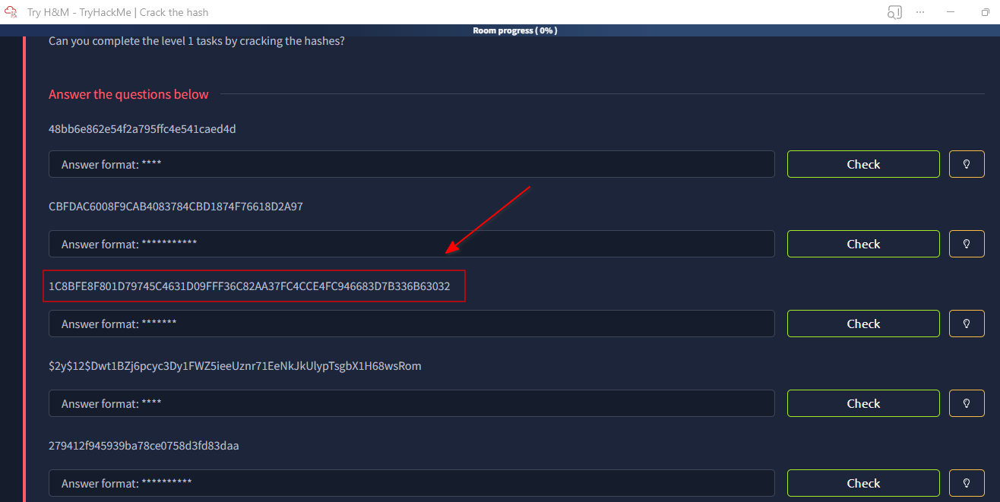
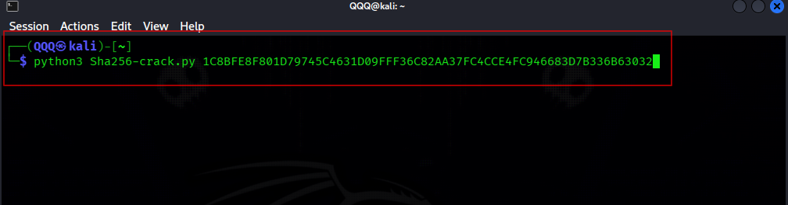
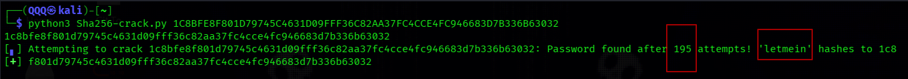

# 📌 Overview

This tutorial demonstrates the process of **cracking password hashes** using a custom-built Python script.

All hashes used in this lab were obtained from the Crack the Hash on **TryHackMe (THM)**, a platform designed for hands-on cybersecurity training.

The room provides multiple hash types; however:

 **This write-up focuses specifically on SHA256** to demonstrate how dictionary-based attacks can break weak passwords even when strong hashing algorithms are used.

---

# 🧪 In this write-up, we cover

* Extracting hashes from THM
* Identifying hash types
* Executing a dictionary attack
* Understanding script behavior
* Recovering and validating credentials

---

# 🛠 Core Concepts & Tools

* Python → Script development
* Custom Script → SHA256 cracking logic
* Kali Linux → Attacker machine
* Wordlists (SecLists) → Password candidates
* SHA256 → Cryptographic hashing algorithm
* Crack the Hash → Hash source

---

# 🧭 Walkthrough

## 1️⃣ Hash Collection from THM

The hashes were collected directly from the Crack the Hash interface on TryHackMe.




Example hashes provided in the room:

```text
48bb6e862e54f2a795ffc4e541caed4d
CBFDAC6008F9CAB4083784CBD1874F76618D2A97
1C8BFE8F801D79745C4631D09FFF36C82AA37FC4CCE4FC946683D7B336B63032
$2y$12$Dwt1BZj6pcyc3Dy1FWZ5ieeUznr71EeNkJkUlypTsgbX1H68wsRom
279412f945939ba78ce0758d3fd83daa
```

---

## 2️⃣ Hash Identification

The hashes provided by Crack the Hash include multiple formats, identified using length and structure.

### 🔍 Quick Identification Tips

* **MD5**

  * 32 characters
* **SHA1**

  * 40 characters
* **SHA256**

  * 64 characters
* **bcrypt**

  * Starts with `$2y$`

 **Focus of this lab: SHA256**

---

## 3️⃣ Environment Setup

* Attacker Machine: Kali Linux
* Script: `Sha256-crack.py`
* Wordlist: `10k-most-common.txt`

---

## 4️⃣ Attack Methodology

A dictionary attack was performed on the SHA256 hash obtained from THM:

* Read password from wordlist
* Convert to bytes
* Generate SHA256 hash
* Compare with target

✔ Sequential testing
✔ Stops when match is found

---

## 5️⃣ Script Execution

```bash
python3 Sha256-crack.py 1C8BFE8F801D79745C4631D09FFF36C82AA37FC4CCE4FC946683D7B336B63032
```



---

## 6️⃣ Live Attack Output



 Key Observations:

* Script iterated through password candidates
* Progress displayed during execution
* Password found after **195 attempts**
* Process terminated immediately

---

## 7️⃣ Credential Discovery

* **Recovered Password:** `letmein`

> **The password was successfully cracked from a hash provided by THM.**

---

## 8️⃣ Validation

* Hash of `letmein` was recalculated
* Result matched the original SHA256 hash

✔ Confirms successful cracking
✔ Validates script accuracy

---

## 9️⃣ Attack Behavior Analysis

The attack demonstrated:

* Efficient dictionary-based cracking
* Immediate detection of correct credentials
* Dependence on password strength

 Insight:

Even in a structured lab like Crack the Hash, weak passwords are quickly exposed.

---

# What You Learn

* How to extract and analyze hashes from THM
* How to identify hash types quickly
* How dictionary attacks work internally
* How to build and use a custom cracking script
* Why weak passwords are a major vulnerability

---

# ⚠️ Limitations

* Single-threaded execution
* No GPU acceleration
* Dependent on wordlist quality
* Not effective against strong passwords

---

Here’s the same section, cleaned up with **no emojis** and kept concise and professional:

---

# Mitigation

To protect against password cracking and hash-based attacks:

---

## Use Strong Passwords

* Minimum **12–16 characters**, **20+ recommended** for sensitive accounts
* Prefer **long passphrases** over short complex passwords

---

## Store Passwords Securely

* Avoid plain SHA256
* Use **Argon2, bcrypt, or scrypt**
* Always apply a **unique salt**

---

## Limit Attack Attempts

* Enforce **rate limiting** and account lockouts
* Add delays after failed logins

---

## Enable Multi-Factor Authentication (MFA)

* Prevent access even if credentials are compromised

---

## Prevent Password Reuse

* Enforce unique passwords per system
* Use password managers

---

## 📌 Conclusion

This lab from the Crack the Hash shows that even strong hashing like SHA256 cannot protect weak passwords.

Security ultimately depends on **strong credentials and proper handling**, not just the algorithm.


---

This work is part of **FuzzRaiders’ structured hands-on training and research program,** where every lab, project, and technical study is formally documented, reviewed, and validated to ensure real-world applicability, methodological rigor, and practical execution.
--

**Happy hacking 🚀**


