# 🧠 Fundamentals

---

## 📖 About

The **Fundamentals** section focuses on building the **core technical foundation** required for all FuzzRaiders members before advancing into specialized cybersecurity domains.

This area covers essential knowledge in programming, scripting, networking, and operating systems — forming the base layer for all offensive and defensive security skills.

Content is structured to ensure **clarity, progression, and strong technical understanding**, preparing members for real-world cybersecurity challenges.

---

## 🎯 Purpose

This section exists to:

* Build strong foundational knowledge across all members
* Standardize core technical skills within the team
* Prepare members for advanced cybersecurity domains
* Support certification readiness and technical growth
* Eliminate weak foundations before specialization

The focus is on mastering **fundamentals first**, before moving into advanced security topics.

---

## 📂 Repository Structure

```id="fd2k8x"
Fundamentals/
│
├── Programming/
│   ├── C/
│   ├── Python/
│   ├── C++/
│   ├── C#/
│   ├── Java/
│   ├── Kotlin/
│   └── Assembly/
│
├── Scripting/
│   ├── Bash/
│   └── PowerShell/
│
├── Networking/
│
├── Linux/
│
└── README.md

```

Each folder represents a **core foundational skill area** required for cybersecurity.

The structure is designed to ensure **progressive learning and long-term scalability**.

---

## 📚 Content Scope

Content in this section may include:

* Programming fundamentals (logic, memory, structures)
* Scripting for automation and system interaction
* Networking basics (protocols, traffic flow, OSI model)
* Linux fundamentals (commands, permissions, system behavior)
* Low-level concepts (memory, processes, execution flow)

All content is designed to build **deep understanding**, not surface-level knowledge.

---

## 🧪 Learning Standards

All learning content must follow the **FuzzRaiders Learning Standard**:

* Clear and structured explanations
* Practical examples and exercises
* Step-by-step breakdown of concepts
* Focus on understanding, not memorization
* Consistent formatting across all topics

Learning must be **active, applied, and measurable**.

---

## 🧠 FuzzRaiders Principle (Core Foundation)

A strong cybersecurity professional is built on:

* Solid programming logic
* Deep system understanding
* Strong networking knowledge
* Ability to think analytically

Without fundamentals, advanced skills will fail.

---

## 📈 Progression Model

All members must:

1. Complete foundational topics
2. Demonstrate understanding through practice
3. Apply knowledge in labs and challenges
4. Transition into specialized domains (Web, AD, Pwn, etc.)

Progression is **structured, not random**.

---

## 🤝 Contributing

Contributions are allowed if they:

* Improve clarity or understanding of core topics
* Add practical learning material or exercises
* Maintain structured and professional format
* Align with team learning objectives

All contributions must be reviewed before acceptance.

---

## 🚀 Goal

To ensure every FuzzRaiders member has:

* Strong technical foundation
* Consistent baseline knowledge
* Readiness for advanced cybersecurity domains
* Long-term technical growth capability

---

## ⚠️ Disclaimer

All content in this repository is intended for **educational purposes only**.

It is designed to support structured learning and skill development within FuzzRaiders.

---

## 🏴 FuzzRaiders

> *“Strong foundations create unstoppable operators.”*
