# 🧠 x86-64 Assembly — Part 2 (Security & Exploits)


## 📌 Overview

> “If Part 1 taught you how programs work, this part shows you how they behave in real systems—and how they can be broken.”

This section continues the Assembly 101 journey, following the **actual course structure**, but explained in a clear, step-by-step way.

You’ll move from:

* Writing assembly
  → to
* Debugging, analyzing, and exploiting programs


---

## 📚 Table of Contents

1. [x86-16 Capstone Challenge](#1️⃣-x86-16-capstone-challenge)
2. [Intro to x86-64](#2️⃣-intro-to-x86-64)
3. [x86-64 Functions](#3️⃣-x86-64-functions)
4. [The Cyber Mentor Coding Challenge — x86-64 Assembly Version](#4️⃣-the-cyber-mentor-coding-challenge-—-x86-64-assembly-version)
5. [Memory Safety](#5️⃣-memory-safety)
6. [Course Outro](#6️⃣-course-outro)

---

## 1️⃣ x86-16 Capstone Challenge

Before moving into 64-bit systems, the course wraps up x86-16 with a **capstone challenge**.

This challenge forces you to combine:

* Registers
* Memory
* Control flow
* Input/output

> Instead of learning concepts separately, you now apply them together.

💡 **Question:** Which concept from Part 1 did you struggle to apply under pressure?

---

## 2️⃣ Intro to x86-64

This section transitions you into **modern architecture**.

---

### 👨‍🏫 AMD64 Programmer’s Manual

This introduces the official documentation for x86-64.

👉 Important mindset:

> You won’t memorize everything—but you must know how to *look things up*

💡 **Question:** Why is documentation critical when working with low-level systems?

---

### x86-16 to 32 to 64 Register Changes

Registers evolve like this:

```asm
AX → EAX → RAX
```

Now you also get:

* RDI, RSI (function arguments)
* RSP (stack pointer)
* RIP (instruction pointer)

💡 **Key Idea:**
More registers = faster and more efficient execution

---

### 🖥️ Revisiting helloworld.c

You revisit a simple C program, but now:

* Compile it
* Inspect it
* Understand what happens under the hood

👉 This bridges:

> High-level code ↔ Assembly

💡 **Question:** Why is it useful to compare C code with its assembly output?

---

### 🖥️ Assembling and Linking

Process:

```asm
Assembly → Object File → Executable
```

* Assembler converts code
* Linker connects everything

---

### 🖥️ Using GDB

> “If you’re not debugging, you’re guessing.”

Now things get real.

With GDB (GNU Debugger), you can:

* Pause execution
* Inspect registers
* View memory
* Step through instructions

👉 Instead of guessing:

You observe exactly what the CPU is doing in real time

---

### Common & Useful GDB Shortcuts

▶️ **Running the Program**

```bash
r
```

Short for: `run` — starts the program inside GDB

🛑 **Setting Breakpoints**

```bash
b main
```

Short for: `break` — pauses execution at a function or address

You can also do:

```bash
b *0x401000
```

💡 Set breakpoints where you want to take control and inspect state

---

🔍 **Stepping Through Code**

* `ni` — Next Instruction (does NOT go inside functions)
* `si` — Step Into (goes inside functions)

📦 **Inspecting Registers**

```bash
info registers
```

Shortcut:

```bash
i r
```

👉 Shows values of RAX, RSP, RIP, etc.

---

🧠 **Examining Memory**

```bash
x/16x $rsp
```

* `x` → examine memory
* `/16x` → show 16 values in hex
* `$rsp` → start from stack pointer

▶️ **Continue Execution**

```bash
c
```

Short for: `continue` — runs until next breakpoint

🧾 **Disassembly View**

```bash
disas main
```

Shortcut:

```bash
disas
```

👉 Shows assembly instructions of a function

---

🖥️ **TUI Mode (Very Useful)**

```bash
tui enable
```

Or directly start with:

```bash
gdb -tui ./program
```

👉 Gives you a split view:

* Assembly
* Registers
* Source (if available)

💡 **Why This Matters**

When working with exploits, you constantly need to:

* Check where RIP is pointing
* Inspect the stack
* See how input affects memory

GDB lets you see the vulnerability happen, not just assume it.

💡 **Question:** Which GDB command would you use to verify that your input overwrote the return address?

---

### 🖥️ Function Epilogues and Prologues

Functions set up and clean up the stack.

Typical structure:

```asm
push rbp
mov rbp, rsp
...
pop rbp
ret
```

💡 **Important:**
The `ret` instruction uses the **return address on the stack**

---

### 🖥️ Position Independent Code

Code that works regardless of memory location.

👉 Important for:

* Shared libraries
* Exploitation

💡 **Question:** Why is position independence useful in modern systems?

---

### 🖥️ Syscall / Write / Read

Programs communicate with the OS using syscalls.

Example:

```asm
mov rax, 1
syscall
```

👉 This replaces older interrupt-based methods.

---

### 🖥️ Using Make

Automates building programs.

Instead of manually compiling:

> You define rules once and reuse them

---

### 🖥️ NASM

Assembler used to write x86-64 assembly.

---

💡 **Section Insight:**
This entire section is about becoming comfortable with:

> Writing, building, and debugging real assembly programs

---

## 3️⃣ x86-64 Functions

Now we go deeper into how functions actually work.

---

### 👨‍🏫 AMD64 System V Application Binary Interface

This defines how functions behave in Linux.

---

### 🖥️ x86-64 Linux ASM Boilerplate

Basic structure of an assembly program.

---

### 🖥️ Interacting With Memory

You directly read/write memory locations.

--> No abstractions—everything is manual.

---

### 🖥️ Memory Alignment

Memory must be aligned (usually 16 bytes).

--> If not:

* Performance issues
* Possible crashes

---

### 🖥️ Functions and Global Variables

In assembly, there’s no concept of “variables” like in high-level languages.
Everything comes down to **where data is stored in memory**.

To understand programs properly, you need to distinguish between:

* **Local variables (stack-based)**
* **Global variables (data section)**

---

## 🔹 Local Variables (Stack)

Local variables exist **only inside a function**.

They are stored on the **stack**, which means:

* They are temporary
* They disappear when the function returns

---

### 📦 How It Works

When a function starts, it sets up a stack frame:

```asm
push rbp
mov rbp, rsp
sub rsp, 16
```

This does 3 things:

1. Saves old base pointer
2. Creates a new stack frame
3. Allocates space for local variables

---

### 🧠 Example

```asm
mov QWORD [rbp-8], 5
```

This means:

> Store value `5` in a local variable

-->  `[rbp-8]` is just a memory location inside the function’s stack frame.

---

### 💡 Key Idea

Local variables are:

* Fast
* Temporary
* Function-specific

Once the function ends:

```asm
leave
ret
```

--> The stack is cleaned → variables are gone

---

💡 **Question:** Why can’t a local variable be accessed after a function returns?

---

## 🔹 Global Variables (Data Section)

Global variables are stored in a **fixed memory region**, not the stack.

They are defined outside functions and exist for the **entire program runtime**.

---

### 📦 Example

```asm
section .data
msg db "Hello", 0
```

Here:

* `msg` is a global variable
* Stored in the **data section**
* Accessible from anywhere in the program

---

### 🧠 Accessing Global Variables

```asm
mov rax, msg
```

-->  Loads the address of `msg`

---

### 💡 Key Idea

Global variables are:

* Persistent
* Shared across functions
* Stored in a fixed location

---

💡 **Question:** Why might global variables be useful but also risky?

---

## 🔹 Stack vs Global (Important Difference)

| Feature  | Local Variables | Global Variables |
| -------- | --------------- | ---------------- |
| Location | Stack           | Data Section     |
| Lifetime | Temporary       | Entire program   |
| Scope    | Inside function | Everywhere       |
| Speed    | Very fast       | Slightly slower  |

---

## 🔥 Why This Matters (Security Perspective)

Understanding this difference is critical for exploitation.

---

### 🧠 Stack (Target for Attacks)

* Contains:

  * Local variables
  * Return address
* Vulnerable to:

  * Buffer overflows
--> This is where most exploits happen

---

### 🧠 Global Memory

* More stable
* Harder to overflow directly
* But still useful for:

  * Storing important data
  * Targeting in advanced attacks

---

## 🔁 Putting It Together

Think of it like this:

* Stack → temporary workspace
* Global memory → permanent storage

---

💡 **Final Question:**
If an attacker overflows a local buffer, which part of memory are they most likely targeting—and why?

---

### 🖥️ Passing Args Via Registers (Part 1 & 2)

Arguments go into:

```asm
RDI, RSI, RDX, RCX, R8, R9
```

---

### 🖥️ Passing Args Via Stack

If more arguments are needed:

> They go on the stack

---

💡 **Key Insight:**
Understanding this is critical because:

> Exploits rely on knowing exactly how data is passed and stored

---

### 1️⃣0️⃣ Coding Challenge (Don’t Print X)

A practical challenge to reinforce:

* Logic
* Conditions
* Control flow

---

## 4️⃣ The Cyber Mentor Coding Challenge — x86-64 Assembly Version

This is a **full application challenge**.

You are expected to:

* Think independently
* Apply all learned concepts

--> This simulates real-world problem solving.

💡 **Question:** What part of the challenge required the most debugging?

---

## 5️⃣ Memory Safety

🚨 This is the most important section for security.

---

### 🖥️ Reviewing Stack Overflow Source Code

You analyze vulnerable code:

```c
char buffer[8];
gets(buffer);
```

---

### 🖥️ Investigating Stack Overflow with GDB

Now you:

* Run the program
* Overflow it
* Watch memory change

--> You *see* the vulnerability happen

---

### 🖥️ Basic Stack Overflow Exploit

You craft input to overwrite:

```asm
[ buffer ][ RBP ][ RIP ]
```

> “Every abstraction is a layer of trust. Exploitation begins where that trust is misplaced.”

---

### 🖥️ Mitigating Stack Overflow Vulnerability

You learn:

* Why this is dangerous
* How developers try to prevent it

---

### 🖥️ Writing Shellcode (Part 1 & 2)

You create payloads that:

* Execute commands
* Spawn shells

---

### 🖥️ Avoiding Bad Characters

Some bytes break exploits (like NULL).

--> You must carefully craft input.

---

### 🖥️ Disabling Memory Corruption Protections

To learn exploitation:

* Protections are temporarily disabled

---

### 🖥️ Stack Smashing with Shellcode

Full attack flow:

```asm
Overflow → Control RIP → Execute Shellcode
```

---

### 🖥️ Reversing Shellcode

Understanding how shellcode works internally.

---

### 1️⃣0️⃣ Coding Challenge (Privilege Escalation)

Final challenge:

* Combine everything
* Achieve higher privileges

This is closest to real-world exploitation.

---

💡 **Section Insight:**
You move from:

> “This is a vulnerability”
> to
> “I can exploit this vulnerability”

---

## 6️⃣ Course Outro

By the end of this course, you have:

* Built assembly programs
* Debugged them
* Understood memory layout
* Exploited real vulnerabilities

> “Assembly is no longer just readable—it’s usable.”

---

## 🧠 Final Takeaway

Part 1:

> How programs work

Part 2:

> How programs break

Together:

> You understand systems at a level most developers never reach

As a last word, I would like to say:

**“Once you understand how software breaks, you’ll never look at code the same way again.”**
---


# Author: [QQQ](#)

