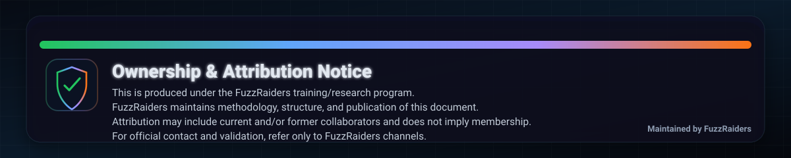

# 📌 Overview CCNA 200-301

I have successfully completed the CCNA 200-301 course, covering the fundamentals of networking, including device communication, data flow, network design, and security. Through this journey, I built a strong foundation in networking concepts, protocols, and real-world operations, gaining practical skills in routing, switching, IP services, and troubleshooting across both small LANs and large-scale networks.


# 🎯 Key Concepts Learned

## 🌐 Networking Fundamentals

### OSI Model & TCP/IP Model

Structured layers define how data is transmitted across networks.

```
You open website
     ↓
Application (HTTP)
     ↓
Transport (TCP)
     ↓
Internet (IP)
     ↓
Network Access (Frame/Bits)
     ↓
Server
```

### Encapsulation & Data Flow

Data is wrapped with headers at each layer before transmission:

| Layer          | Unit    |
| -------------- | ------- |
| Data           | Data    |
| Transport      | Segment |
| Internet       | Packet  |
| Network Access | Frame   |
| Physical       | Bits    |

---

### IP Addressing (IPv4)

* Logical addressing system to uniquely identify devices on a network.
* 32-bit address, divided into 4 octets (8 bits each).
* Example: `192.168.1.1`

| Octet | Binary   | Decimal |
| ----- | -------- | ------- |
| 1     | 11000000 | 192     |
| 2     | 10101000 | 168     |
| 3     | 00000001 | 1       |
| 4     | 00000001 | 1       |

**Key Points:**

* IPv4 = 4 numbers (0–255) separated by dots.
* Private vs Public IP: Private IPs are used inside local networks, Public IPs are used on the Internet.

**Analogy:** IP address = Home address

```
Your Device → Adds destination IP → Internet routes it → Correct device receives data
```

---

### Subnetting Basics

Divides a network into smaller segments for efficiency and control.

```
Company Network
     ↓
-------------------------
| HR | IT | Finance |
-------------------------
Separate subnets
```

---

## 🔌 Network Access

### Ethernet & MAC Addressing

Devices communicate in LAN using unique hardware addresses.

```
[ PC A ] --MAC--> [ Switch ] --MAC--> [ PC B ]
```

### Switching Concepts

* Switch forwards data using MAC tables.
* Learns MAC addresses → sends data to correct port only.

### VLAN Basics

Logical separation of networks on the same physical switch.

```
Switch
 ├── VLAN 10 (HR)
 └── VLAN 20 (IT)
(No direct communication)
```

### Port Security

| MAC Status     | Action  |
| -------------- | ------- |
| Authorized MAC | ✅ Allow |
| Unknown MAC    | ❌ Block |

### Cable Types

| Connection Type | Cable Type       |
| --------------- | ---------------- |
| PC → Switch     | Straight-through |
| Switch → Switch | Crossover        |
| Long Distance   | Fiber            |

---

## 🌍 IP Connectivity

### Routing Fundamentals

Forwarding data between networks:

```
Device → Router → ISP → Internet → Server
```

### Routing Types

| Type    | Description                         |
| ------- | ----------------------------------- |
| Static  | Manually configured routes          |
| Dynamic | Automatically learned routes (OSPF) |

### Default Gateway

Exit point from a local network.

```
Device → Default Gateway → Internet
```

### Packet Forwarding

```
Incoming Packet
      ↓
Check Routing Table
      ↓
Forward to Next Router
```

---

## ⚡ IP Services

| Service | Purpose                                 |
| ------- | --------------------------------------- |
| NAT     | Translates private IPs to public IP     |
| DHCP    | Automatically assigns IP addresses      |
| DNS     | Converts domain names into IP addresses |

**DHCP Process:** Discover → Offer → Request → Acknowledge

**DNS Process:**

```
google.com → DNS Server → Returns IP → Connect to Server
```

---

## 🔒 Security Fundamentals

| Concept          | Description                               |
| ---------------- | ----------------------------------------- |
| Network Security | Protect networks from unauthorized access |
| Port Security    | Limit access to trusted devices           |
| Threat Awareness | Detect, analyze, prevent risks            |

---

## ☁️ Modern Networking

| Concept            | Description                                                    |
| ------------------ | -------------------------------------------------------------- |
| Cloud Computing    | Services delivered over the internet (Public, Private, Hybrid) |
| WAN Technologies   | Connect networks over long distances                           |
| Data Center Basics | Centralized infrastructure hosting servers                     |
| SDN                | Centralized control of networks using software                 |

---

## 🛠️ Practical Skills Gained

| Skill Area                          | Activities                                    |
| ----------------------------------- | --------------------------------------------- |
| Configuring network devices         | Setup and manage routers/switches             |
| Network troubleshooting             | Systematic issue resolution (Ping, Cable, IP) |
| Cable creation & Ethernet standards | T568A/B wiring, crimp, test cable             |
| Port security                       | Disable unused ports, secure used ports       |
| IP addressing & subnetting          | Assign IP ranges, divide subnets              |

---

** > “In networking, small misconfigurations create big problems — precision is everything.”**




# Author: [QQQ](#)




